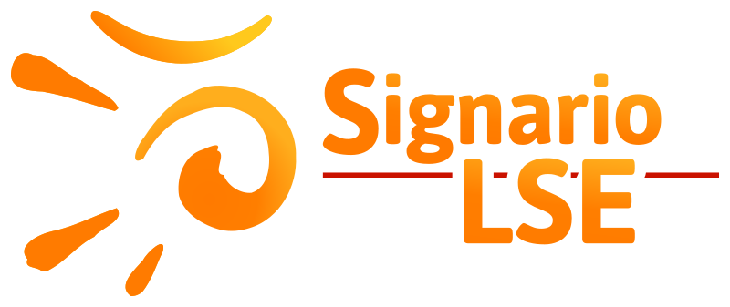

    

# Signario

Meta-repositorio de código para el proyecto ["Signario de LSE: Diccionario
paramétrico de la lengua de signos española"](https://www.ucm.es/signariolse/).

Ver en vivo: <https://griffos.filol.ucm.es/signario>

- [meta](https://github.com/mateodelnorte/meta)

## Componentes

- [data](https://github.com/agarsev/signario-data): vídeos del Signario.
- [eduardo](https://github.com/agarsev/signario-eduardo): programa que
    corta vídeos con listas de signos en vídeos individuales.
- [guillermo](https://github.com/agarsev/signario-guillermo): programa para
    gestionar la base de datos de signos del Signario.
- [web](https://github.com/agarsev/signario-web): interfaz web del Signario.
- [signotator](https://github.com/agarsev/signotator): herramienta de entrada
    visual de LSE en Signotación.

## Créditos

<table>
<tr><td align="center">

  
José María Lahoz Bengoechea  
<jmlahoz@ucm.es>

</td><td align="center">

  
Antonio F. G. Sevilla  
<antonio@garciasevilla.com>

</td></tr>
</table>

Proyecto realizado con la Beca Leonardo a Investigadores y Creadores Culturales
2021 de la Fundación BBVA.

La Fundación BBVA no se responsabiliza de las opiniones, comentarios
y contenidos incluidos en el proyecto y/o los resultados obtenidos del mismo,
los cuales son total y absoluta responsabilidad de sus autores.
